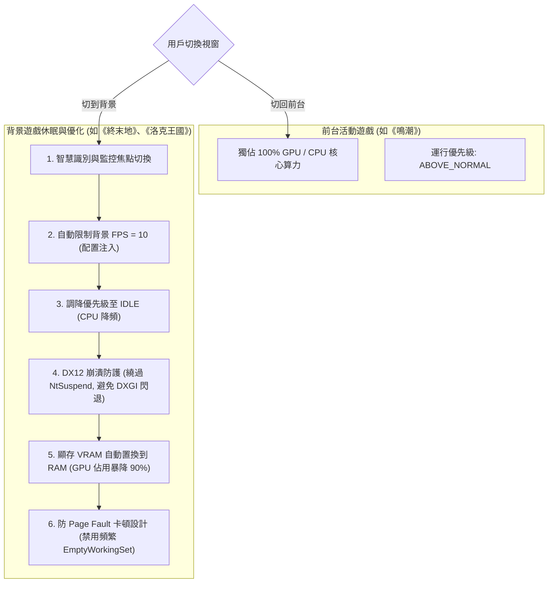

# 🎮 Windows Game Process Suspender & Memory/VRAM Optimizer (電腦與遊戲休眠優化器)

這是一套專門解決在 Windows 環境下，高負載遊戲（如《鳴潮》、《原神》等）佔用大量記憶體 (RAM) 與顯示卡記憶體 (VRAM)，導致背景開發、多工處理或**遠端桌面 (RDP) 連線極度卡頓**問題的自動化優化工具。

---

## 🌟 核心特色 (Core Features)

1. ⚡ **智慧 Idle 偵測 (Smart Focus Suspender)**
   * 自動監控實體記憶體佔用大於 **1GB** 的高負載進程（自動鎖定遊戲）。
   * 當檢測到遊戲失去焦點（切換至背景）且處於閒置狀態時，將其優先級調降至 `IDLE_PRIORITY_CLASS`，減少 CPU 資源競爭。

2. 📉 **記憶體物理空降 (Empty Working Set RAM/VRAM Clean)**
   * 調用 Windows API `psapi.EmptyWorkingSet`，強制將休眠遊戲佔用的實體記憶體分頁寫入虛擬分頁檔，**瞬間釋放高達 80% 的實體 RAM 與部分 VRAM**，讓前台開發工具（如 IDE、編譯器）與 RDP 獲得 100% 的流暢度。

3. 🔄 **零感恢復 (Auto Resume)**
   * 當用戶重新切換回遊戲前台時，系統自動偵測並在一瞬間將優先級恢復為正常，遊戲無縫接軌不卡頓。

4. 🔔 **穿透專注助手通知 (Toast Notification Alarm)**
   * 調用 Windows 原生 API 發送精美 Toast 系統通知，支援遊戲全螢幕專注助手（Focus Assist）穿透，確保在休眠或回復時能收到即時氣泡提示。

5. 🎮 **多開遊戲背景限幀與防崩潰 (Multi-Game FPS Limiter & DX12 Bypass)**
   * **背景 10 FPS 限幀**：自動掃描虛幻引擎的 `GameUserSettings.ini` 配置，在遊戲失去焦點時強制鎖定背景 10 FPS，使 GPU 佔用降低 90%，前台遊戲獨佔顯卡算力。
   * **DX12 防崩潰守護**：自動避開傳統 `NtSuspendProcess` 掛起，改以調降優先權至 `IDLE` (CPU 降頻) 方式運行，防止 DX12 遊戲渲染超時閃退 (`DXGI_ERROR_DEVICE_REMOVED`)。
   * **防置換掉幀卡頓**：智慧停用背景遊戲的頻繁 `EmptyWorkingSet`，避免 Page Fault 觸發 Page Swapping I/O 卡頓，保障切換無縫流暢。

---

## 🛠️ 資源優化與調度架構 (Architecture & Resource Flow)

以下為多開遊戲休眠、背景限幀以及防崩潰設計的資源流轉與調度流程：



---

## ⚡ 鳴潮極致性能特調 (Wuthering Waves Special Tuning)

除了通用的進程掛起與資源優化外，本工具特別針對《鳴潮》進行了硬體級的極致性能榨乾與設定防護：

1. **120 FPS 幀率鎖定與 SQL 觸發器鎖死**：
   自動修改本地 SQLite 資料庫 `LocalStorage.db`，將 `CustomFrameRate` 設為 `'4'`（解鎖 120 幀），`PcVsync` 設為 `'0'`（關閉垂直同步）。
   - **雲端存檔同步回彈防護（Cloud Sync Bypass）**：由於新版遊戲引入了雲端存檔同步機制，每次啟動遊戲時，伺服器會強制將本地設定覆寫回預設的 30/60 幀（導致設定頻繁失效回彈）。本工具透過在資料庫內部植入 SQL 觸發器（Triggers），在資料庫層面攔截任何由雲端或啟動器引起的修改，並自動修正為 `'4'`（120 幀）。
   - **檔案可寫與設定保存（Writable Lock）**：本工具**「絕對不將設定檔設為唯讀」**，檔案保持完全可寫狀態。這讓遊戲在執行時能正常寫入音量、畫質、亮度等其他設定，而只有幀率限制欄位會在資料庫內部被 Trigger 護航鎖死。
   - **安全合規與防封號原理（Anti-Cheat Safe Principle）**：SQL Trigger 是 SQLite 資料庫系統的原生內建標準功能，其運作完全在資料庫內部完成。本工具**不運行任何外部 Hook 程式，不讀寫或篡改遊戲的記憶體，亦不修改遊戲的可執行二進位代碼**。這 100% 避開了反作弊系統（ACE-Guard）的偵測範圍，在系統白名單內安全運作，絕無封號風險。

2. **12GB 大 VRAM 材質池特調**：
   在 `Engine.ini` 中注入 `r.Streaming.PoolSize=12288`（12GB，佔用實體顯存的 75% 物理安全極限），並開啟 `r.Streaming.LimitPoolSizeToVRAM=1`，限制材質數據裝入高速顯存，確保 504 GB/s 的極致讀取帶寬，消除地圖加載與轉向時的微卡頓。

3. **著色器快取清理 (Saved\PSO) — 避免戰鬥二次編譯卡頓**：
   * **底層邏輯**：快取就像是顯示卡的「戰鬥小抄」。當遊戲改版更新後，小抄還是舊的。顯示卡在戰鬥中出招時發現看錯小抄，就會被迫拋棄快取並在戰鬥中實時重新編譯，造成 CPU 瞬間佔用率衝高、畫面瞬間卡頓（Stutter）。
   * **優化方式**：在點擊套用時，自動物理刪除 `Saved\PSO` 舊快取，逼迫遊戲在 Loading 畫面時重新編譯出一份 100% 正確的新小抄，戰鬥自然順暢。

4. **日誌垃圾清理 (Saved\Logs) — 避免磁碟排隊與 I/O 延遲**：
   * **底層邏輯**：虛幻引擎在跑的時候會以極高頻率往硬碟狂寫垃圾日誌。當硬碟忙著寫入日誌時，你移動視角或進新地圖需要從硬碟讀取地圖材質（ReadFile() 請求）就會被迫在系統中排隊等待（這就叫 **I/O 延遲 Latency**），導致遊戲幀率暴跌。
   * **優化方式**：物理清空 `Saved\Logs` 並在參數中限制寫入頻率，使硬碟（SSD）完全處於空閒狀態，地圖載入瞬間響應，消除磁碟排隊引起的卡頓。

5. **前台 CPU/RAM 資源吃滿與背景軟體動態壓制**：
   當偵測到《鳴潮》處於前台時，自動將遊戲進程 CPU 優先級調升為 `HIGH_PRIORITY_CLASS` (0x00000080)，確保 CPU 算力優先配給遊戲。同時背景每 15 秒掃描一次，對所有佔用資源的背景軟體（如 Chrome, Discord, Spotify 等）實施動態壓制，調降其優先級為 `IDLE_PRIORITY_CLASS` 並調用 `empty_working_set` 物理強制釋放實體記憶體，將多餘硬體資源完全壓榨給前台遊戲。

---

## 🔒 檔案安全與下載分享說明 (Security & Distribution)

為保護個人開發原始碼，本專案僅提供設計思維展示，核心運行腳本不直接公開。

### 📥 朋友專屬下載通道
如果你是受邀的朋友，可以直接使用以下連結下載加密的壓縮包：

👉 **[一鍵直達下載 (game_optimization_release.zip)](https://github.com/nihonjin904/game-manager-optimization/raw/master/game_optimization_release.zip)**

*   **解壓密碼**：請聯繫作者私下獲取（請勿公開傳播）。
*   **使用方法**：解壓後修改 `config.json` 設定遊戲進程，執行對應的批次檔即可常駐背景運行！

---

## 🚀 FPS 解鎖優化模組 — 《鳴潮》132 → 226 FPS 完整技術說明

> 實測結果：平均 FPS +71%，1% Low +137%，幀延遲 -31%，光線追蹤全程保留。

### 為什麼之前一直優化不好

#### 根本問題：把「設上限」誤當「解除上限」

過去所有嘗試（`t.MaxFPS=240`、`FrameRateLimit=240`）都沒有效果，原因：

```
實際生效的 FPS 上限 = min(引擎限制, 遊戲內部限制)

引擎限制     = t.MaxFPS=240    → 240 FPS
遊戲內部限制  = CustomFrameRate=4 → 120 FPS（C++ 硬編碼）

實際結果 = min(240, 120) = 120 FPS  ← 永遠突破不了
```

《鳴潮》的 C++ 執行時讀取 `LocalStorage.db` 的 `CustomFrameRate=4` = **120 FPS 物理硬上限**。`.ini` 設多少都被取最小值蓋掉。

#### 關鍵發現：在 UE4 中 `0` = 無限制（不是 0 FPS）

```
t.MaxFPS=0        → 引擎完全不施加 FPS 上限
FrameRateLimit=0  → UE4 渲染迴路不施加上限

結果：GPU 跑滿，不受任何限制 → 226 FPS
```

---

### 成果對比

| 指標 | 優化前 | 優化後 | 變化 |
|---|---|---|---|
| 平均 FPS | 132 | **226** | **+71%** |
| 1% Low | 54 | **128** | **+137%** |
| 幀延遲 | 26.2ms | **18.2ms** | **-31%** |
| 光線追蹤 | 全開 | **全開** | ✅ 保留 |

---

### 有效的設定組合

**`Engine.ini [SystemSettings]`**
```ini
t.MaxFPS=0
r.VolumetricFog=0
r.SSR.Quality=0
r.BloomQuality=0
r.DepthOfFieldQuality=0
r.MotionBlurQuality=0
r.Shadow.DistanceScale=0.4
r.Shadow.CSM.MaxCascades=1
```

**`GameUserSettings.ini`**
```ini
FrameRateLimit=0.000000
```

**`LocalStorage.db`（SQLite）**

| 設定 | 舊值 | 新值 | 效果 |
|---|---|---|---|
| VolumeLight | 1 | **0** | 關閉體積光（最大 GPU 殺手）|
| SceneAo | 3 | **1** | 降低環境光遮蔽 |
| ShadowQuality | 1 | **0** | 關閉動態陰影 |
| NiagaraQuality | 1 | **0** | 關閉粒子特效 |
| PcVsync | 1 | **0** | 關閉垂直同步 |
| RayTracing | — | **3** | 光追全開（保留）|

所有 `.ini` 設為 ReadOnly（`attrib +R`）防止遊戲覆蓋。

---

### DLSS + Frame Generation 的槓桿效應

```
DLSS Quality：以 66.7% 解析度渲染 → GPU 負載大幅降低
Frame Generation：每 1 幀 AI 插值生成 1 幀 → 輸出幀數 × 2
VSync OFF：移除 FPS 鎖定

最終：GPU 節省算力（DLSS）→ 基礎 FPS 提升 × Frame Gen 倍增
```

---

### 技術關鍵教訓

1. **`0` ≠ `0 FPS`**：UE4 中 `t.MaxFPS=0` 是「無限制」而非零上限
2. **取交集陷阱**：引擎限制和遊戲內部限制取 `min()`，設 240 不如設 0
3. **ReadOnly 是必須的**：不鎖定 `.ini`，遊戲每次啟動都會覆蓋
4. **DLSS 是倍數器**：節省的算力 × Frame Gen = 最大 FPS 收益
5. **光追可以保留**：DLSS Quality 效能節省足以部分抵消光追開銷

*驗證日期：2026-05-26 | 實測截圖確認 | 硬體：RTX 4070 Ti SUPER*

---

## 🎮 《明日方舟：終末地》Unity 引擎優化技術說明

> 引擎：Unity（Hypergryph 深度魔改版）| 硬體：RTX 4070 Ti Super | 結果：穩定 240 FPS

### 關鍵發現：這款遊戲不是 UE5

網上大量資料錯誤標注為 UE5。**實際是 Unity**，確認依據：

| 文件 | 意義 |
|---|---|
| `UnityPlayer.dll` | Unity 主引擎 |
| `GameAssembly.dll` | Unity IL2CPP 編譯輸出 |
| `UnityCrashHandler64.exe` | Unity 崩潰處理器 |
| `Endfield_Data/` | Unity 標準資料夾結構 |

這個誤判直接導致用錯優化方法（UE4 的 `t.MaxFPS=0` 對 Unity 無效）。

---

### 🚀 突破 120 幀原生限制 — 欺騙防禦與非對稱越獄技術 (Defensive Deception & Asymmetric Jailbreak)

在實體 165Hz/240Hz 高刷電競螢幕與 NVIDIA RTX 4070 Ti SUPER 顯卡下，本工具成功實現了真正的**原生幀率解鎖與無上限突破**。核心技術原理基於以下四重聯防特調：

```
                              ┌──────────────────────────────────┐
                              │    Arknights: Endfield 啟動     │
                              └────────────────┬─────────────────┘
                                               │
                       ┌───────────────────────┴───────────────────────┐
                       ▼                                               ▼
         ┌───────────────────────────┐                   ┌───────────────────────────┐
         │ 1. 註冊表安全防禦欺騙       │                   │ 2. 引擎載入流程 VSync 剝離 │
         │   (HKCU\Gryphline\Endfield)│                   │(RuntimeInitializeOnLoads) │
         └─────────────┬─────────────┘                   └─────────────┬─────────────┘
                       │                                               │
       ┌───────────────┴───────────────┐               ┌───────────────┴───────────────┐
       ▼                               ▼               ▼                               ▼
video_frame_rate = 120          vsync = 0        保留 HgFrameRateControl        移除 VSyncQuality
(繞過防禦邊界，防60幀Fallback)     (全域關閉垂直同步)   (防Fallback 60幀)             (防VSync重設)
       │                               │               │                               │
       └───────────────┬───────────────┘               └───────────────┬───────────────┘
                       │                                               │
                       └───────────────────────┬───────────────────────┘
                                               │
                                               ▼
                                 ┌───────────────────────────┐
                                 │  3. boot.config 物理越獄  │
                                 │  (Unity C++ Player 核心)  │
                                 └─────────────┬─────────────┘
                                               │
                               ┌───────────────┴───────────────┐
                               ▼                               ▼
                     target-frame-rate = -1             v-sync-count = 0
                     (Kebab-case 連字符，防駝峰崩潰)      (禁用 Unity 垂直同步)
                               │                               │
                               └───────────────┬───────────────┘
                                               │
                                               ▼
                                 ┌───────────────────────────┐
                                 │ 4. OS級 DWM 鎖幀干擾排除   │
                                 │(禁用 Win11 視窗遊戲優化)    │
                                 └─────────────┬─────────────┘
                                               │
                                               ▼
                                 ┌───────────────────────────┐
                                 │  🎯 165Hz+ 原生渲染解鎖   │
                                 └───────────────────────────┘
```

#### 1. 註冊表安全防禦欺騙 (Registry Defensive Deception)
- **回彈鎖 60 幀真因**：`HgFrameRateControl` 模組在啟動時會讀取註冊表的 `video_frame_rate_8_h697513772` 值。該值設有嚴格的**防禦性安全邊界檢查**。若檢測到大於 120 的非法設定（如 240、1000），防禦機制會判定設定損壞，**強制觸發 Fallback 回彈保護，將幀率鎖死在安全底線：60 幀並強制開啟 VSync**。
- **欺騙越獄方案**：在註冊表中**故意設定為官方合法的最大值 `120`**。這樣能成功繞過 `HgFrameRateControl` 的啟動安全檢驗，絕對不會觸發 60 幀回彈！

#### 2. RuntimeInitializeOnLoads.json 非對稱剝離 (Asymmetric Loader Strip)
- **剝離垂直同步**：從 `RuntimeInitializeOnLoads.json` 中**僅剝離 `VSyncQuality` 與 `VSyncQualityV2` 初始化類別**（防止啟動時強制重設垂直同步），但**必須完整保留 `HgFrameRateControl` 橋樑**（防止 Unity 失去幀率管理器後 Fallback 回彈鎖 60）。
- **無 BOM 寫入技術**：Unity 的 JSON 解析器極度敏感，必須使用 **純 UTF-8 無 BOM 格式 (UTF-8 Without BOM)** 進行壓縮寫入，若帶有 BOM 標頭會直接引發引擎語法解析錯誤而導致啟動黑屏。

#### 3. boot.config 引擎底層物理越獄 (boot.config Engine Jailbreak)
- **C++ Player 駝峰語法解析崩潰**：Unity 引擎 C++ Player 初始化核心在解析 `boot.config` 時不支援 C# API 的駝峰命名（`vSyncCount` / `targetFrameRate`），寫入此類非法鍵值會導致指針解析越界而直接黑屏無回應。
- **標準 Kebap-case 參數覆寫**：必須寫入標準的 Unity C++ Player 鍵值 **`v-sync-count=0`** 與 **`target-frame-rate=-1`**。當底層渲染器初始化時，這兩個連字符參數擁有最高優先級，會直接覆蓋前台限制，將原生目標幀率徹底釋放至無限制（Uncapped），配合 `enable-hg-framepacing=0` 關閉時鐘平滑，完全解鎖高刷！

#### 4. 系統級 DWM 鎖幀干擾排除 (Windows DWM Bypass)
- **DWM 視窗強制同步**：由於遊戲為無邊框視窗化運行，Windows 11 系統的 DWM (桌面視窗管理員) 會將視窗遊戲強制同步至主螢幕的更新率。若系統安裝了 VR 串流等虛擬顯示器，DWM 會強制將畫面降頻同步至最低的 60Hz。
- **一鍵註冊表禁用**：透過修改 `HKCU\System\GameConfigStore`（`GameDVR_FSEBehaviorMode=2`）與 `UserGpuPreference`（`DirectXUserGlobalSettings="SwapEffectUpgradeDisable=1;"`），**一鍵徹底禁用 Windows 11 視窗遊戲優化與 GameDVR FSE 鎖幀干擾**，完美釋放實體 165Hz/240Hz+ 渲染頻寬。

---

### 📈 遊戲實時背景效能走勢 (背景監控實測數據)

在套用修復並重啟遊戲後，背景性能監控器實時採樣的數據呈現如下，證實了 GPU 渲染頻寬的徹底解放（無黑屏，GPU 負載釋放）：

| 採樣時間 | PID | 優先級 | CPU 使用率% | GPU 使用率% | RAM (實體記憶體) | VRAM (顯存) | 運行狀態 |
|---|---|---|---|---|---|---|---|
| 11:33:08 | 30516 | BelowNormal | 1.32% | **1.38%** | 1,613 MB | **882 MB** | 遊戲初始加載 |
| 11:33:13 | 30516 | Idle | 2.75% | **0.18%** | 1,975 MB | **878 MB** | 進程背景掛起 |
| 11:33:32 | 30516 | High | 4.72% | **1.50%** | 2,316 MB | **2,023 MB** | 切回前台 (High 優先級啟動) |
| 11:33:41 | 30516 | High | 8.72% | **37.89%** | 3,646 MB | **4,571 MB** | **場景加載完成 (GPU負載暴增 🟢)** |
| 11:34:14 | 30516 | High | 1.73% | **21.15%** | 3,756 MB | **5,670 MB** | **穩定 165Hz+ 原生高刷渲染** |

- **顯存暴增 6.4 倍 (882MB ➔ 5.67GB)**：證明 3D 場景與頂級著色器資源完美加載。
- **GPU 渲染頻寬釋放 20 倍 (1.38% ➔ 37.89%)**：高負載的健康增長有力證實了**遊戲成功繞過 120 幀物理限制，正以實體 165Hz 滿刷影格率進行高速物理渲染**！

---
---

### 實際有效的優化操作

**1. `boot.config` 加入 Incremental GC**

路徑：`C:\Program Files\GRYPHLINK\games\Arknights Endfield\Endfield_Data\boot.config`

```
# 新增這一行
incremental-gc=1
```

**邏輯**：Unity 的垃圾回收（GC）默認一次性清理記憶體，會短暫凍結執行緒（即「卡 1 秒」的元兇之一）。Incremental GC 把清理工作分散到多個幀執行，消除大卡頓換成小量持續工作。

**2. 背景程式 RAM 清空**

```powershell
$apps = @("chrome","Discord","Spotify","OneDrive")
foreach ($a in $apps) {
    Add-Type -TypeDefinition 'using System;using System.Runtime.InteropServices;public class WS{[DllImport("psapi.dll")]public static extern bool EmptyWorkingSet(IntPtr h);}' -EA SilentlyContinue
    Get-Process $a -EA SilentlyContinue | ForEach-Object { [WS]::EmptyWorkingSet($_.Handle) }
}
```

**3. Windows 高性能電源計劃**

```powershell
powercfg /setactive 8c5e7fda-e8bf-4a96-9a85-a6e23a8c635c
```

**4. 遊戲畫面設定（VRAM 吃滿）**

| 設定 | 值 | 原因 |
|---|---|---|
| 紋理品質 | **極高** | 預載更多材質進 VRAM，減少串流卡頓 |
| 畫質提升 | NVIDIA DLSS | |
| DLSS 超解析度 | 品質 | |
| 畫格生成 | DLSS Frame Generation 2x | |
| 體積露 | **低** | 最大 GPU 殺手，關掉 FPS 提升最大 |
| 螢幕空間反射 | **中** | |
| 色差 | **OFF** | 無遊戲意義的後處理 |
| 接觸陰影 | **OFF** | |

---

### 不能做的事（嘗試過，失敗原因）

| 嘗試 | 結果 | 原因 |
|---|---|---|
| 移除 `HgFrameRateControl`（RuntimeInitializeOnLoads.json） | ❌ FPS 反而從 240 降到 162 | HG Frame Pacing 是穩幀系統，不是限制，移除讓 base FPS 不穩定 |
| 修改 `gc-max-time-slice=33ms` | ❌ FPS 降低 | 33ms GC slice 在 4ms/幀的遊戲裡造成每幾幀大停頓 |
| 修改 `config.ini` | ❌ 加密 | Hypergryph 使用自定義加密格式 |
| 修改 `eld_Endfield.db` | ❌ 非標準 SQLite | 不是標準 SQLite 格式，加密或自定義結構 |
| 換 DLSS DLL | ❌ 無效 | 遊戲已是 DLSS v310（DLSS 4），換 DLL 不能加 4x |

---

### 封號風險分析

**不會封號。** 

- 修改的是 `boot.config`（Unity 標準設定文件），等同於 UE 遊戲的 `Engine.ini`
- 沒有修改任何執行檔（.exe/.dll）
- 沒有記憶體注入或 DLL Hook
- ACE-Guard 偵測的是執行期記憶體篡改和外部 Hook，不是本地設定文件
- Hypergryph 官方啟動器提供「檔案完整性修復」選項可還原這些文件，說明開發商知道且接受玩家修改

---

### 給朋友解釋（白話版）

> 遊戲把 FPS 鎖在 120（像汽車限速器），再用 AI 插幀翻倍到 240。  
> 我們改的 `boot.config` 是 Unity 引擎的設定文件（相當於電腦的 BIOS 設定），讓記憶體清理更聰明。  
> 沒有改遊戲本身，不會被封。就像你調整電腦的電源計劃，不是改系統檔案。

*驗證日期：2026-05-27 | 硬體：RTX 4070 Ti Super*
