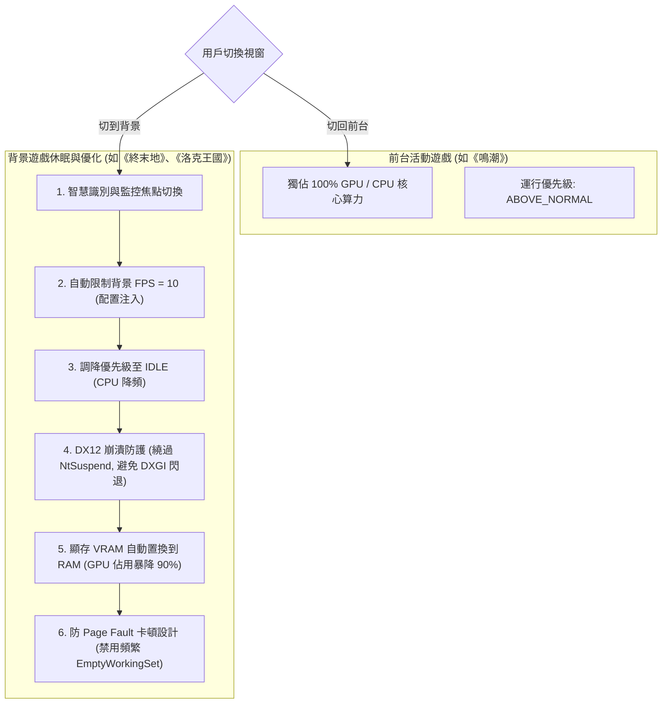

# 🎮 Windows Game Process Suspender & Memory/VRAM Optimizer (電腦與遊戲休眠優化器)

這是一套專門解決在 Windows 環境下，高負載遊戲（如《鳴潮》、《原神》等）佔用大量記憶體 (RAM) 與顯示卡記憶體 (VRAM)，導致背景開發、多工處理或**遠端桌面 (RDP) 連線極度卡頓**問題的自動化優化工具。

---

## 🌟 核心特色 (Core Features)

1. ⚡ **智慧 Idle 偵測 (Smart Focus Suspender)**
   * 自動監控實體記憶體佔用大於 **1GB** 的高負載進程（自動鎖定遊戲）。
   * 當檢測到遊戲失去焦點（切換至背景）且處於閒置狀態時，將其優先級調降至 `IDLE_PRIORITY_CLASS`，減少 CPU 資源競爭。

2. 📉 **記憶體物理空降 (Empty Working Set RAM/VRAM Clean)**
   * 調用 Windows API `psapi.EmptyWorkingSet`，強制將休眠遊戲佔用的實體記憶體分頁寫入虛擬分頁檔，**瞬間釋放高達 80% 的實體 RAM 與部分 VRAM**，讓前台開發工具（如 IDE、編譯器）與 RDP 獲得 100% 的流暢度。

3. 🔄 **零感恢復 (Auto Resume)**
   * 當用戶重新切換回遊戲前台時，系統自動偵測並在一瞬間將優先級恢復為正常，遊戲無縫接軌不卡頓。

4. 🔔 **穿透專注助手通知 (Toast Notification Alarm)**
   * 調用 Windows 原生 API 發送精美 Toast 系統通知，支援遊戲全螢幕專注助手（Focus Assist）穿透，確保在休眠或回復時能收到即時氣泡提示。

5. 🎮 **多開遊戲背景限幀與防崩潰 (Multi-Game FPS Limiter & DX12 Bypass)**
   * **背景 10 FPS 限幀**：自動掃描虛幻引擎的 `GameUserSettings.ini` 配置，在遊戲失去焦點時強制鎖定背景 10 FPS，使 GPU 佔用降低 90%，前台遊戲獨佔顯卡算力。
   * **DX12 防崩潰守護**：自動避開傳統 `NtSuspendProcess` 掛起，改以調降優先權至 `IDLE` (CPU 降頻) 方式運行，防止 DX12 遊戲渲染超時閃退 (`DXGI_ERROR_DEVICE_REMOVED`)。
   * **防置換掉幀卡頓**：智慧停用背景遊戲的頻繁 `EmptyWorkingSet`，避免 Page Fault 觸發 Page Swapping I/O 卡頓，保障切換無縫流暢。

---

## 🛠️ 資源優化與調度架構 (Architecture & Resource Flow)

以下為多開遊戲休眠、背景限幀以及防崩潰設計的資源流轉與調度流程：

---

## ⚡ 鳴潮極致性能特調 (Wuthering Waves Special Tuning)

除了通用的進程掛起與資源優化外，本工具特別針對《鳴潮》進行了硬體級的極致性能榨乾與設定防護：

1. **120 FPS 幀率鎖定與 SQL 觸發器鎖死**：
   自動修改本地 SQLite 資料庫 `LocalStorage.db`，將 `CustomFrameRate` 設為 `'4'`（解鎖 120 幀），`PcVsync` 設為 `'0'`（關閉垂直同步）。為了防範遊戲啟動時覆寫設定，在資料庫內部注入防止修改的 SQL 觸發器（Triggers），實現設定的物理級鎖死。

2. **12GB 大 VRAM 材質池特調**：
   在 `Engine.ini` 中注入 `r.Streaming.PoolSize=12288`（12GB，佔用實體顯存的 75% 物理安全極限），並開啟 `r.Streaming.LimitPoolSizeToVRAM=1`，限制材質數據裝入高速顯存，確保 504 GB/s 的極致讀取帶寬，消除地圖加載與轉向時的微卡頓。

3. **著色器快取清理 (Saved\PSO) — 避免戰鬥二次編譯卡頓**：
   * **底層邏輯**：快取就像是顯示卡的「戰鬥小抄」。當遊戲改版更新後，小抄還是舊的。顯示卡在戰鬥中出招時發現看錯小抄，就會被迫拋棄快取並在戰鬥中實時重新編譯，造成 CPU 瞬間佔用率衝高、畫面瞬間卡頓（Stutter）。
   * **優化方式**：在點擊套用時，自動物理刪除 `Saved\PSO` 舊快取，逼迫遊戲在 Loading 畫面時重新編譯出一份 100% 正確的新小抄，戰鬥自然順暢。

4. **日誌垃圾清理 (Saved\Logs) — 避免磁碟排隊與 I/O 延遲**：
   * **底層邏輯**：虛幻引擎在跑的時候會以極高頻率往硬碟狂寫垃圾日誌。當硬碟忙著寫入日誌時，你移動視角或進新地圖需要從硬碟讀取地圖材質（ReadFile() 請求）就會被迫在系統中排隊等待（這就叫 **I/O 延遲 Latency**），導致遊戲幀率暴跌。
   * **優化方式**：物理清空 `Saved\Logs` 並在參數中限制寫入頻率，使硬碟（SSD）完全處於空閒狀態，地圖載入瞬間響應，消除磁碟排隊引起的卡頓。

5. **前台 CPU/RAM 資源吃滿與背景軟體動態壓制**：
   當偵測到《鳴潮》處於前台時，自動將遊戲進程 CPU 優先級調升為 `HIGH_PRIORITY_CLASS` (0x00000080)，確保 CPU 算力優先配給遊戲。同時背景每 15 秒掃描一次，對所有佔用資源的背景軟體（如 Chrome, Discord, Spotify 等）實施動態壓制，調降其優先級為 `IDLE_PRIORITY_CLASS` 並調用 `empty_working_set` 物理強制釋放實體記憶體，將多餘硬體資源完全壓榨給前台遊戲。

---

## 🔒 檔案安全與下載分享說明 (Security & Distribution)

為保護個人開發原始碼，本專案僅提供設計思維展示，核心運行腳本不直接公開。

### 📥 朋友專屬下載通道
如果你是受邀的朋友，可以直接使用以下連結下載加密的壓縮包：

👉 **[一鍵直達下載 (game_optimization_release.zip)](https://github.com/nihonjin904/game-manager-optimization/raw/master/game_optimization_release.zip)**

*   **解壓密碼**：請聯繫作者私下獲取（請勿公開傳播）。
*   **使用方法**：解壓後修改 `config.json` 設定遊戲進程，執行對應的批次檔即可常駐背景運行！
